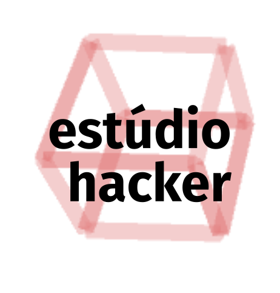

# Estúdio Hacker Day

O Estúdio Hacker Day é um esforço conjunto que reúne pessoas para debater idéias e desenvolver projetos.

Os participantes formam grupos conforme seus interesses e desenvolvem mini-projetos relacionado ao tema escolhido, tudo com a orientação de especialistas nas áreas.
O evento começa com uma explicação da dinâmica do evento e uma apresentação dos temas. Depois segue com a formação dos grupos e a definição dos mini-projetos.

Ao fim do evento, os participantes apresentam suas criações e compartilham o conhecimento adquirido durante o processo.

## Sugestão de projetos

* Introdutórios / exploratórios
  * [FATECINO](https://github.com/jaafreitas/fatecino)
  * [dojo](https://garoa.net.br/wiki/Coding_Dojo_com_Arduino)
  * Programação em blocos utilizando [mBlock](http://www.mblock.cc/) ou [Scratch](https://scratch.mit.edu/projects/editor/)
  * [Lousa mágica](https://github.com/estudiohacker/lousa-magica) - desenho com potenciômetros (Processing + Arduino)

* Intermediários a avançados
  * [Usar dados meteorológicos da Internet para alterar um desenho](https://github.com/estudiohacker/estudio-hacker-day/blob/master/processing/examples/EstudioHacker/examples/TemperaturaCidade/TemperaturaCidade.pde)
  * [Estação meteorológica](https://github.com/jaafreitas/weather-station) com sensor de temperatura, pressão, etc
  * Cubo de LED 3x3x3
  * Carrinho
    * Controle remoto
      * IR
      * Bluetooth
      * WiFi
    * Seguidor de linha
  * Arduino stand-alone (montagem de UNO em protoboard)
  * [Robô Otto](http://otto.strikingly.com/)
  * [Pilãobo](https://github.com/jaafreitas/pilaobo)
  * [IoTmeshToy](https://github.com/jaafreitas/IoTmeshToy)
  * MaKey MaKey utilizando o Arduino Pro Micro
    * [MakeyMakey-Leonardo](https://github.com/robotfreak/MakeyMakey-Leonardo)
    * [Projeto da SparkFun com o esquema e código fonte](https://github.com/sparkfun/MaKeyMaKey)
    * [Guia avançado de reprogramação](https://learn.sparkfun.com/tutorials/makey-makey-advanced-guide)
  * Letreiro / Relógio utilizando a matriz de LED 8x8
  * Alarme residencial
  * Automação residencial
  * P.O.V. utilizando o ATtiny85
  * Trena eletrônica com o sensor ultrasônico
  * Cofre eletrônico com módulo encoder e Scratch
  * Vaso inteligente
  * [PirateBox](https://piratebox.cc/) com um Raspberry PI.

## Mais informações
* [Arduino](arduino)
* [Processing](processing)

